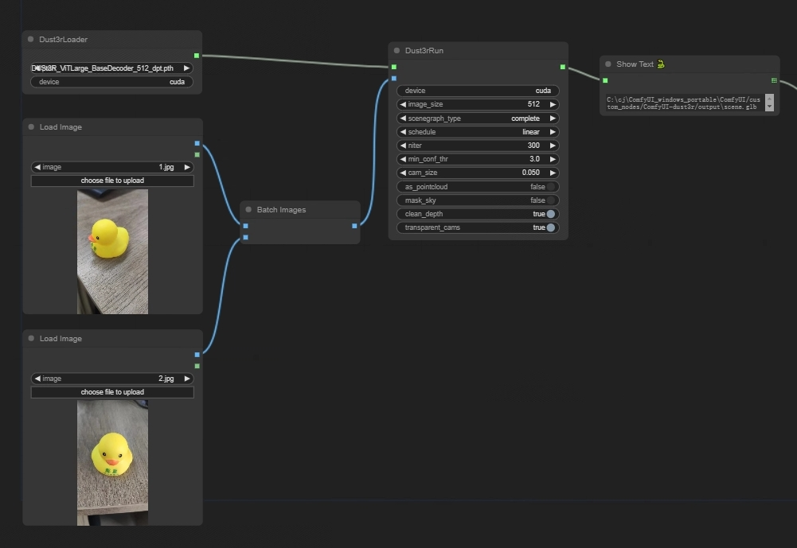

ComfyUI dust3r

### Checkpoints

| Modelname   | Training resolutions | Head | Encoder | Decoder |
|-------------|----------------------|------|---------|---------|
| [`DUSt3R_ViTLarge_BaseDecoder_224_linear.pth`](https://download.europe.naverlabs.com/ComputerVision/DUSt3R/DUSt3R_ViTLarge_BaseDecoder_224_linear.pth) | 224x224 | Linear | ViT-L | ViT-B |
| [`DUSt3R_ViTLarge_BaseDecoder_512_linear.pth`](https://download.europe.naverlabs.com/ComputerVision/DUSt3R/DUSt3R_ViTLarge_BaseDecoder_512_linear.pth)   | 512x384, 512x336, 512x288, 512x256, 512x160 | Linear | ViT-L | ViT-B |
| [`DUSt3R_ViTLarge_BaseDecoder_512_dpt.pth`](https://download.europe.naverlabs.com/ComputerVision/DUSt3R/DUSt3R_ViTLarge_BaseDecoder_512_dpt.pth) | 512x384, 512x336, 512x288, 512x256, 512x160 | DPT | ViT-L | ViT-B |

Download and place in the directory `ComfyUI\custom_nodes\ComfyUI-dust3r\checkpoints`

## Install

pip install -r requirements.txt

## Basic workflow

https://github.com/chaojie/ComfyUI-dust3r/blob/main/workflow.json

## dust3r

[dust3r](https://github.com/naver/dust3r)